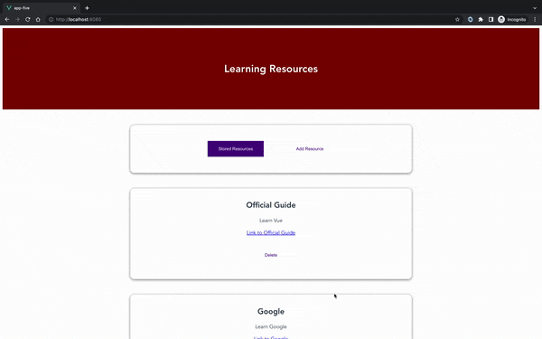
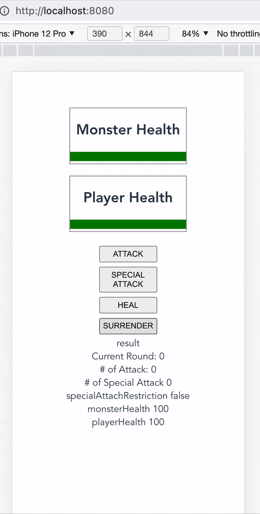
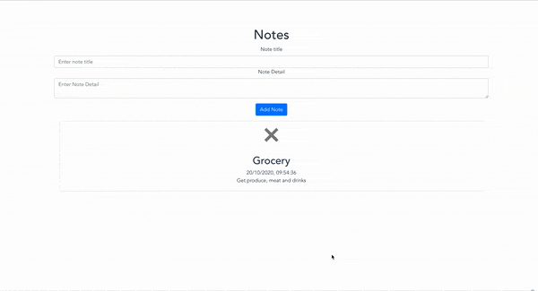
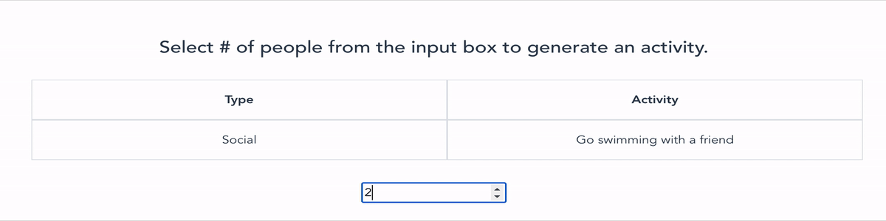

## Demo

### Learning Resources (app-five) demo


### Monster-slayer-game demo


### Notes demo


### Activity demo


## To create a new project, run:
```
vue create my-app
cd my-app
```

## To use Firebase Realtime Database - free version
- Go to Firebase site.
- Click on `Create a project`, and complete all steps.
- Go to `Realtime Database` in your project.
- Click on `Create Database`.
- Choose `Start in test mode` and click enable.

## To install the bootstrap-vue plugin...
```
vue add bootstrap-vue
```

## To install tailwind
```
vue add tailwind
```

- Move these from devDependencies to dependencies if you chose air-bnb linter
```
"@babel/polyfill": "^7.11.5",
"bootstrap": "^4.5.2",
"mutationobserver-shim": "^0.3.7",
```

## To use install axios to make third party API calls (from https://www.npmjs.com/package/vue-axios)
```
npm install --save axios vue-axios
```
- Import libraries in entry file:

```
import Vue from 'vue'
import axios from 'axios'
import VueAxios from 'vue-axios'
```

- Usage in Vue 2:

```
Vue.use(VueAxios, axios)
```

- Usage in Vue 3:

```
const app = Vue.createApp(...)
app.use(VueAxios, axios)
```

- import axios in component (*.vue file) and use it (Example of using it via `mounted` lifecycle hook)
```
<script>
import axios from 'axios';

export default {
  mounted() {
    axios
      .get('https://api.coindesk.com/v1/bpi/currentprice.json')
      .then((response) => console.log(response));
  },
};
</script>
```

## Project setup (from relevant location)
```
npm install
```

### Compiles and hot-reloads for development
```
npm run serve
```

### Compiles and minifies for production
```
npm run build
```

### Run your unit tests
```
npm run test:unit
```

### Lints and fixes files
```
npm run lint
```

### Customize configuration
See [Configuration Reference](https://cli.vuejs.org/config/).

